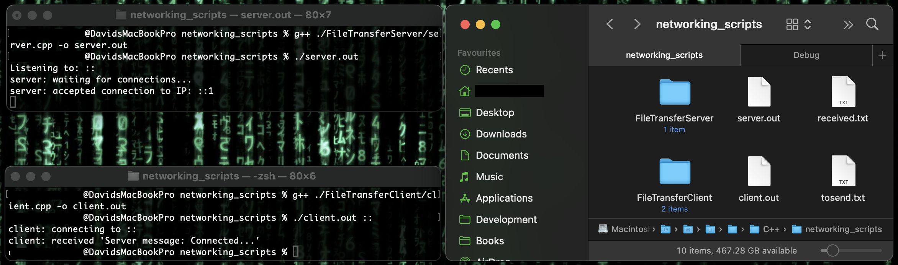

This is a simple example project that demonstrates how to transfer data over TCP connection between a 'server' and 'client'. This uses Unix-based syscalls and thus should be compatible with MacOS, Unix, BSD (untested) and WSL (untested) systems.

To compile, run something like:
`g++ ./FileTransferServer/server.cpp -o server.out & g++ ./FileTransferClient/client.cpp -o client.out`

Prior to running, the client CLI requires a './tosend.txt' file inside its' build directory.
It also requires an IP destination passed as an argument on launch, e.g.:
`./client.out ::` (IPv6) or `./client.out 0.0.0.0` (IPv4), sets the IP connection to any available address.

Run the server first (which listens on all available interfaces), then the client. The server sends a connection confirmation to the client, then the client sends the contents of the './tosend.txt' file to the server.

